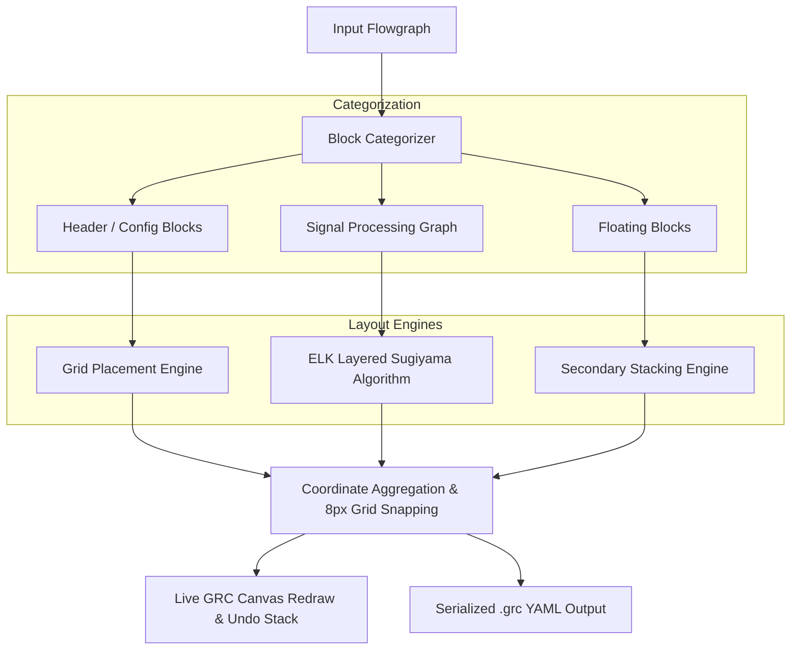

# Architecture & Layout Engine

`grc-autoarrange` bridges **GNU Radio Companion (GRC)** with the **Eclipse Layout Kernel (ELK)**, bringing state-of-the-art graph layout algorithms to software-defined radio flowgraphs.

---

## High-Level Pipeline

---

## 1. Block Classification

GNU Radio flowgraphs contain two fundamentally different kinds of blocks:

1. **Header / Configuration Blocks**:
   - `options`, `variable`, `variable_qtgui_*`, `import`, `parameter`, `snippet`.
   - These blocks do not participate in sample streaming connections. Placing them inside the signal flow causes clutter.
   - **Solution**: `grc-autoarrange` isolates them into a neat, wrapping header banner at the top of the canvas, starting with `options` at `(16, 16)`.

2. **Signal Processing Blocks**:
   - Blocks with input (sink) or output (source) ports forming the processing pipeline (DAG).
   - Routed to the ELK Layered Layout engine.

3. **Floating / Disconnected Blocks**:
   - Signal blocks without active connections are neatly stacked below the main diagram.

---

## 2. ELK Layered Layout & Port Constraints

The core signal DAG is laid out using ELK's **Layered Algorithm** (based on the Sugiyama framework):

- **Layer Assignment**: Nodes are assigned to discrete horizontal layers according to signal flow.
- **Crossing Minimization (`LAYER_SWEEP`)**: Heuristic layer sweeping swaps node positions to minimize cable intersections.
- **Port Constraints (`FIXED_POS`)**:
  - Sink ports (inputs) are positioned on the **WEST** (left) edge.
  - Source ports (outputs) are positioned on the **EAST** (right) edge.
  - Message ports are appropriately oriented.
- **Coordinate Assignment (`BRANDES_KOEPF`)**: Calculates straight, aesthetic edge segments while respecting node heights and port positions.
- **Feedback Loops**: Directed cycles (e.g. Costas loops, PLLs, feedback taps) are detected and routed with inverted feedback edges without breaking the layout.

---

## 3. Grid Snapping

GNU Radio Companion operates on an 8-pixel raster. `grc-autoarrange` applies `snap_to_grid()` to every calculated coordinate:

$$\text{coord}_{\text{snapped}} = 8 \times \text{round}\left(\frac{\text{coord}_{\text{computed}}}{8}\right)$$

This ensures that port connections align with orthogonal wires and GRC's snap-to-grid UI behaves consistently.
