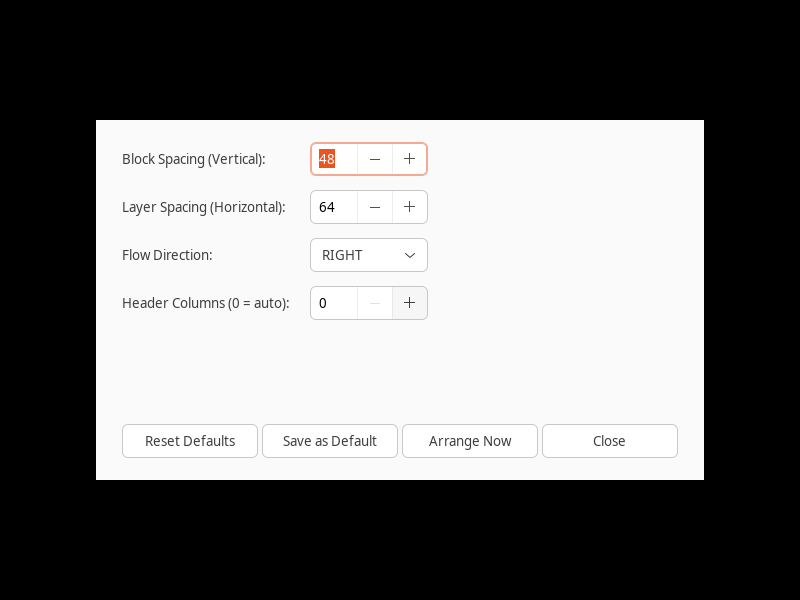
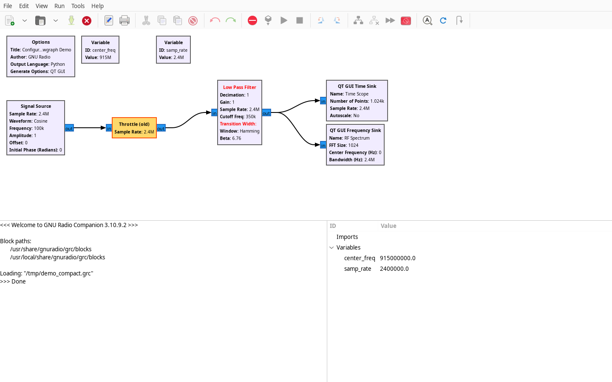
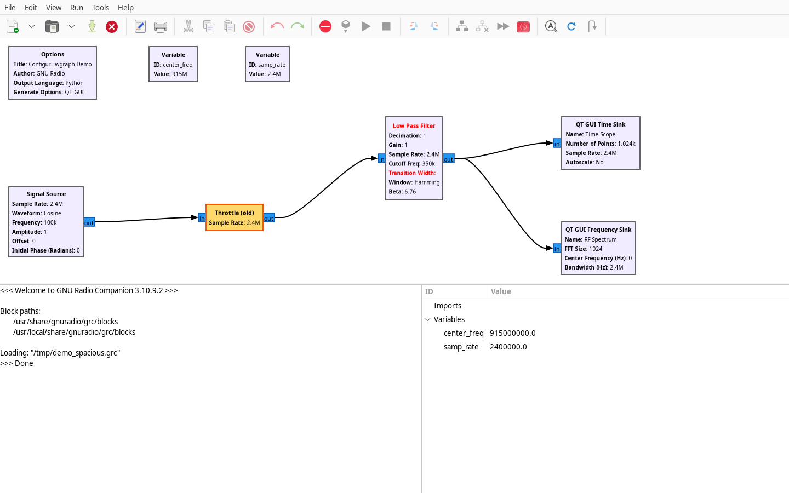
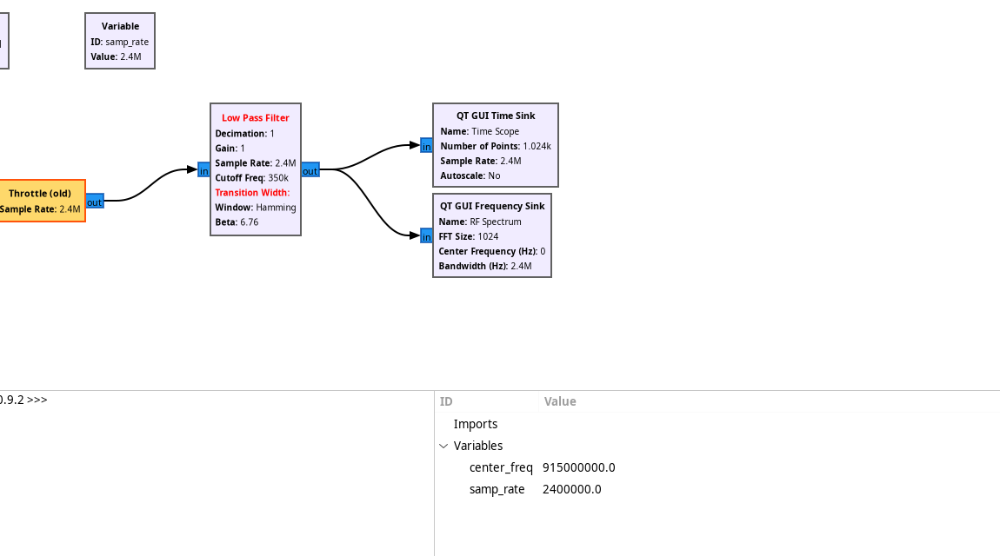
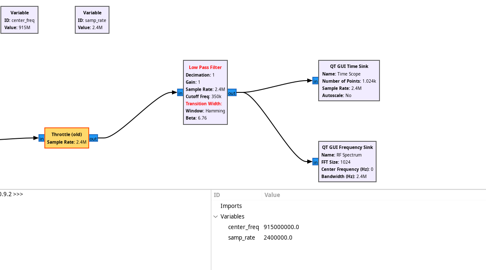

# GNU Radio Companion GUI Addon

`grc-autoarrange` includes native GUI hooks for **GNU Radio Companion (GRC)**. It adds menu options, a settings dialog, a toolbar button, keyboard shortcuts, and full undo/redo integration directly within GRC's GTK3 canvas.

---

## Visual Comparison

<div class="grid cards" markdown>

-   __Before Auto-Arrange__

    ---

    
    *Messy layout with backwards routing and overlapping wires.*

-   __After Auto-Arrange (<kbd>Ctrl</kbd>+<kbd>Shift</kbd>+<kbd>A</kbd>)__

    ---

    
    *Layered Sugiyama DAG with top variable header and 8px grid alignment.*

</div>

---

## Launching GRC with Auto-Arrange

To launch GNU Radio Companion with the Auto-Arrange addon enabled:

```bash
grc-autoarrange --gui [flowgraph.grc]
```

---

## Keyboard Shortcuts & Controls

| Action | Shortcut / Access | Description |
| :--- | :--- | :--- |
| **Auto-Arrange Flowgraph** | <kbd>Ctrl</kbd> + <kbd>Shift</kbd> + <kbd>A</kbd> | Automatically arranges all blocks (or selected blocks). |
| **Auto-Arrange Settings** | `Edit` &rarr; `Auto Arrange Settings...` | Open the graphical configuration dialog. |
| **Menu Access (Edit)** | `Edit` &rarr; `Auto Arrange Flowgraph` | Triggers layout calculation and redraws canvas. |
| **Menu Access (Tools)** | `Tools` &rarr; `Auto Arrange Flowgraph` | Alternative menu placement. |
| **Toolbar Button** | :material-format-justify-fill: icon on toolbar | Single-click auto-arrange. |
| **Undo** | <kbd>Ctrl</kbd> + <kbd>Z</kbd> | Reverts canvas to state prior to auto-arrange. |
| **Redo** | <kbd>Ctrl</kbd> + <kbd>Y</kbd> / <kbd>Ctrl</kbd> + <kbd>Shift</kbd> + <kbd>Z</kbd> | Re-applies auto-arrange layout. |

---

## Configurable Spacing & Settings Dialog

You can customize block spacing, layer spacing, and layout direction dynamically from within GRC via **Edit &rarr; Auto Arrange Settings...**:

<p align="center">
  
</p>

### Settings Options
- **Block Spacing (Vertical / Same Layer)**: Control vertical spacing between blocks in the same layer (8px to 300px).
- **Layer Spacing (Horizontal / Between Layers)**: Control spacing between consecutive processing stages (8px to 400px).
- **Flow Direction**: Choose `RIGHT` (standard left-to-right), `DOWN` (top-to-bottom), `LEFT`, or `UP`.
- **Header Columns**: Set fixed column count for top variable header or `0` for auto-wrap.
- **Save as Default**: Persists your preferences to `~/.config/gnuradio/grc_autoarrange.json` so every future session uses them.

---

## Spacing Comparison Examples

Adjusting block spacing allows you to optimize for tight, compact canvas views or spacious, easily readable diagrams:

=== "🔹 Compact Spacing (Spacing: 24px)"

    <figure markdown>
      { width="100%" style="border-radius: 8px; border: 1px solid var(--md-default-fg-color--lightest); box-shadow: 0 4px 16px rgba(0,0,0,0.2);" }
      <figcaption><strong>Compact Spacing:</strong> Ideal for complex, multi-stage flowgraphs to fit maximum components on screen without overlapping.</figcaption>
    </figure>

=== "🔸 Spacious Layout (Spacing: 96px)"

    <figure markdown>
      { width="100%" style="border-radius: 8px; border: 1px solid var(--md-default-fg-color--lightest); box-shadow: 0 4px 16px rgba(0,0,0,0.2);" }
      <figcaption><strong>Spacious Layout:</strong> Provides ample room between processing blocks and clear separation of parallel branches.</figcaption>
    </figure>

=== "🔍 Side-by-Side Canvas View"

    | Compact Spacing (`--spacing 24`) | Spacious Layout (`--spacing 96`) |
    | :---: | :---: |
    | { style="border-radius: 6px; border: 1px solid var(--md-default-fg-color--lightest);" } | { style="border-radius: 6px; border: 1px solid var(--md-default-fg-color--lightest);" } |
    | *Tight, space-efficient block arrangement* | *Wide separation for complex feedback paths* |

---

## Selection-Only Layout

If your flowgraph is large and you only want to organize a localized portion (e.g. a demodulator subsystem):

1. **Select the blocks** you want to organize by dragging a selection rectangle or holding <kbd>Ctrl</kbd> and clicking.
2. Press <kbd>Ctrl</kbd> + <kbd>Shift</kbd> + <kbd>A</kbd>.
3. Only the selected blocks will be arranged relative to each other; all unselected blocks remain untouched!
