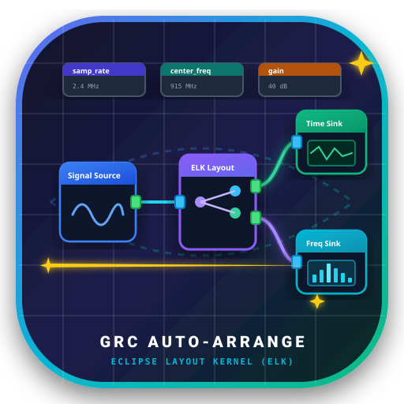
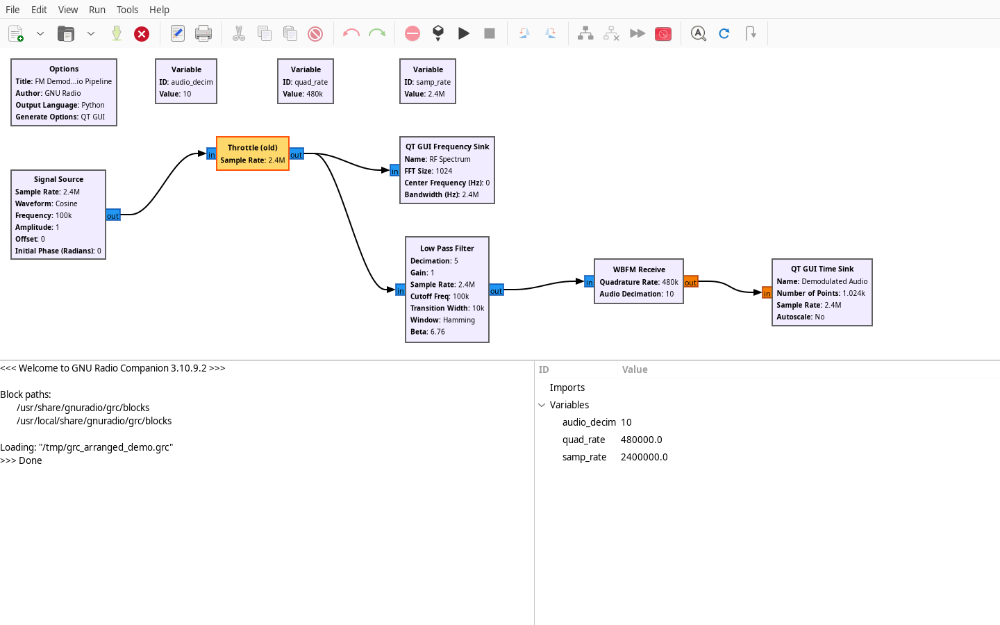
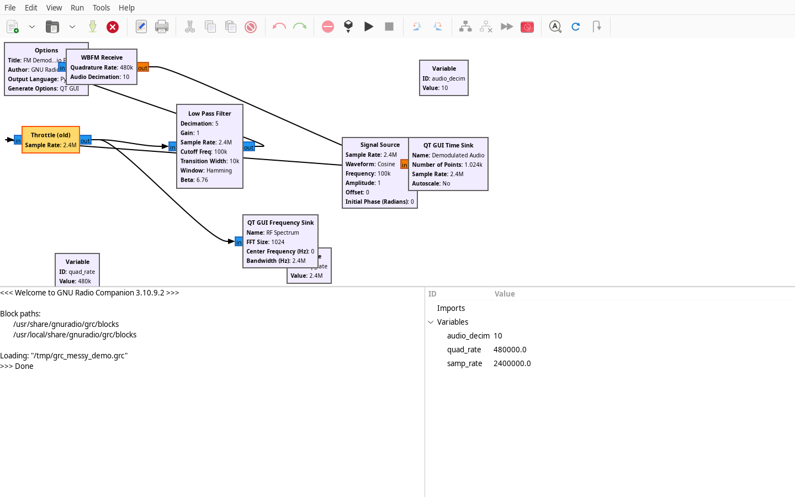
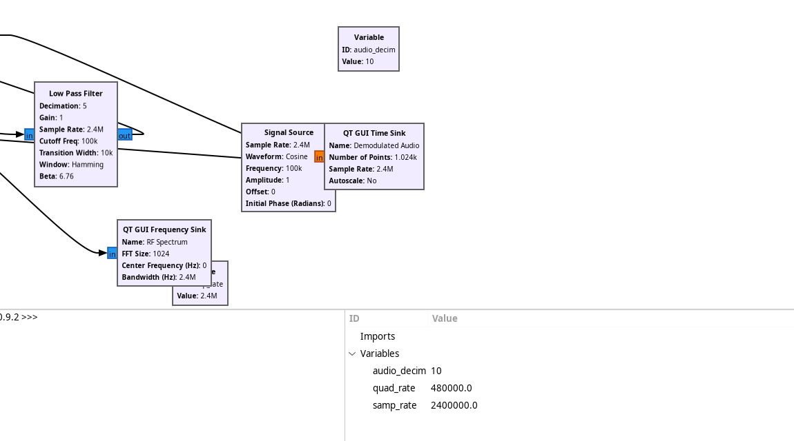
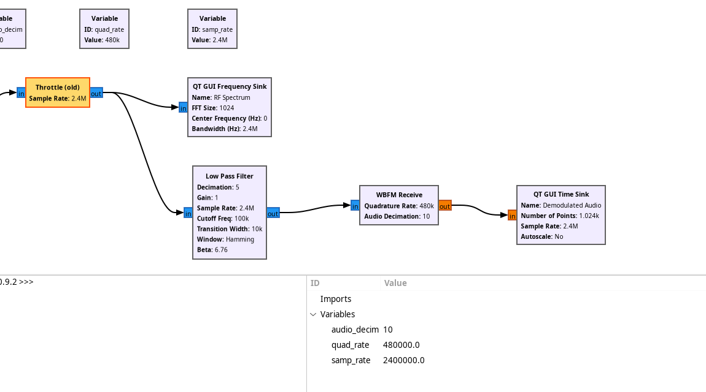

<p align="center" style="margin-bottom: 0;">
  
</p>

# GRC Auto-Arrange

<p align="center" style="font-size: 1.25rem; font-weight: 500; color: var(--md-default-fg-color--light);">
  Intelligent, automated block placement and flowgraph beautifier for <strong>GNU Radio Companion (GRC)</strong> powered by the <strong>Eclipse Layout Kernel (ELK)</strong>.
</p>

---

## ⚡ Interactive Live Demo

Watch messy, tangled flowgraphs automatically arrange into an optimal layered DAG with zero cable crossings:

<div class="grc-demo-container">
  <div class="grc-demo-toolbar">
    <div style="display: flex; align-items: center; gap: 10px;">
      <span id="grc-status-badge" class="grc-badge">⚠️ Messy Flowgraph (Unarranged)</span>
      <span style="opacity: 0.7; font-size: 0.75rem;">GNU Radio Companion Canvas Simulation</span>
    </div>
    <div style="display: flex; gap: 8px;">
      <button id="grc-trigger-btn" class="md-button md-button--primary" style="padding: 2px 12px; font-size: 0.75rem; border-radius: 4px; cursor: pointer;">
        ⚡ Auto-Arrange (Ctrl+Shift+A)
      </button>
    </div>
  </div>
  <div id="grc-animation-root" class="grc-demo-canvas">
    <!-- Interactive SVG rendered by flowgraph_anim.js -->
  </div>
</div>

---

## 📸 GNU Radio Companion Before & After

See the actual GNU Radio Companion 3.10 interface before and after running **Auto-Arrange Flowgraph**:

=== "✨ After Auto-Arrange (ELK Layered)"

    <figure markdown>
      { width="100%" style="border-radius: 8px; border: 1px solid var(--md-default-fg-color--lightest); box-shadow: 0 4px 20px rgba(0,0,0,0.2);" }
      <figcaption><strong>After:</strong> Variables cleanly stacked in the top header row; signal processing flow structured left-to-right with straight orthogonal connections and 8px grid alignment.</figcaption>
    </figure>

=== "⚠️ Before Auto-Arrange (Messy)"

    <figure markdown>
      { width="100%" style="border-radius: 8px; border: 1px solid var(--md-default-fg-color--lightest); box-shadow: 0 4px 20px rgba(0,0,0,0.2);" }
      <figcaption><strong>Before:</strong> Blocks scattered randomly across the canvas with backwards routing, intersecting wires, and misaligned variables.</figcaption>
    </figure>

=== "🔍 Canvas Close-Up Comparison"

    | Before Auto-Arrange | After Auto-Arrange |
    | :---: | :---: |
    | { style="border-radius: 6px; border: 1px solid var(--md-default-fg-color--lightest);" } | { style="border-radius: 6px; border: 1px solid var(--md-default-fg-color--lightest);" } |
    | <em>Scattered blocks, tangled diagonal wires</em> | <em>Clean layered DAG, variables in header banner</em> |

---

## 🚀 Key Highlights

<div class="grid cards" markdown>

-   :material-view-dashboard-variant:{ .lg .middle } __Direct GRC Integration__

    ---

    Seamlessly adds **Auto Arrange Flowgraph** into GRC's Edit/Tools menu and toolbar. Press <kbd>Ctrl</kbd> + <kbd>Shift</kbd> + <kbd>A</kbd> to tidy up your canvas in real time.

-   :material-undo-variant:{ .lg .middle } __Full Undo / Redo Support__

    ---

    Integrated directly into GRC's native state history. Hit <kbd>Ctrl</kbd> + <kbd>Z</kbd> to roll back or <kbd>Ctrl</kbd> + <kbd>Y</kbd> to redo anytime.

-   :material-format-list-group:{ .lg .middle } __Smart Block Categorization__

    ---

    Automatically isolates configuration variables (`samp_rate`, `cutoff`, etc.) into a tidy top banner while structuring signal processing blocks into a left-to-right DAG.

-   :material-grid:{ .lg .middle } __8px Grid Snapping__

    ---

    All block coordinates strictly adhere to GNU Radio Companion's standard 8-pixel alignment grid for pixel-perfect wiring.

-   :material-terminal:{ .lg .middle } __Headless CLI & Pre-Commit Hook__

    ---

    Format `.grc` flowgraph files headlessly with `grc-autoarrange -i flowgraph.grc` or automate repository linting in CI/CD pipelines.

-   :material-package-variant-closed:{ .lg .middle } __Zero NPM Dependencies__

    ---

    Includes a bundled standalone Eclipse Layout Kernel (ELK) engine that runs effortlessly on any system with Node.js installed.

</div>

---

## 📦 Quick Start

=== "1. Install"

    ```bash
    pip install --user .
    ```

=== "2. Launch GRC with Auto-Arrange"

    ```bash
    grc-autoarrange --gui my_flowgraph.grc
    ```

=== "3. Or Format Headlessly"

    ```bash
    # Format in-place
    grc-autoarrange -i my_flowgraph.grc

    # Output to new file
    grc-autoarrange input.grc -o output.grc
    ```
